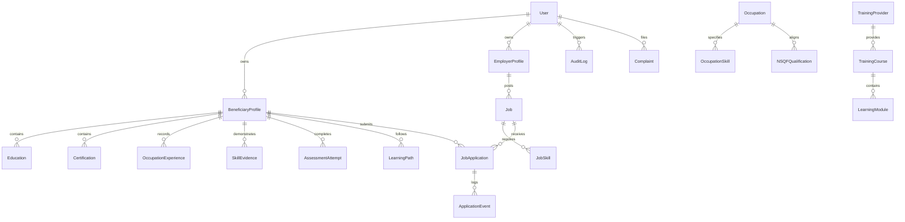

# Database & Data Model Architecture — Aura Platform

## 1. Relational Database Strategy

Aura implements an enterprise-grade relational database architecture using PostgreSQL and Prisma ORM (`prisma/schema.prisma`), paired with an in-memory high-throughput data store (`server/src/services/store.ts`) for zero-dependency development and testing.

---

## 2. Core Entities & Relationships

### Key Models Defined in `prisma/schema.prisma`:
- **Identity & Security**: `User`, `Role`, `Session`, `PhoneVerification`, `AuditLog`
- **Beneficiary Dossier**: `BeneficiaryProfile`, `BeneficiaryPreference`, `Education`, `Certification`, `OccupationExperience`, `Skill`, `SkillEvidence`, `SkillCategory`
- **Occupational Standards**: `Occupation`, `OccupationSkill`, `NSQFQualification`, `QualificationSkill`
- **Training & Skilling**: `TrainingProvider`, `TrainingCourse`, `LearningPath`, `LearningModule`, `LearningResource`
- **Assessment Engine**: `Assessment`, `AssessmentQuestion`, `AssessmentAttempt`, `AssessmentResult`
- **Opportunities & Hiring**: `Employer`, `EmployerVerification`, `Job`, `JobSkill`, `CandidateMatch`, `JobApplication`, `ApplicationEvent`, `Interview`, `EmploymentOutcome`
- **Grievance Redressal**: `Complaint`, `ComplaintEvent`
- **Regional Telemetry**: `RegionalSkillData`, `DistrictMetric`

---

## 3. Indexing & Optimization Strategy

Composite and targeted single-column B-tree indexes are implemented across high-frequency lookup columns:
- `User(phoneNumber)`, `User(email)`, `User(role)`
- `BeneficiaryProfile(userId)`, `BeneficiaryProfile(district)`, `BeneficiaryProfile(state)`
- `SkillEvidence(profileId)`, `SkillEvidence(name)`, `SkillEvidence(evidenceStatus)`
- `Job(employerId)`, `Job(district)`, `Job(sector)`, `Job(status)`
- `JobApplication(jobId)`, `JobApplication(profileId)`, `JobApplication(status)`
- `AuditLog(userId)`, `AuditLog(resource)`, `AuditLog(timestamp)`

---

## 4. Seeding & Migrations

- **Migration Command**: `npx prisma migrate dev --name init`
- **Seed Command**: `npm run db:seed`
- **Data Integrity**: Foreign keys employ `CASCADE` deletions on child attributes (e.g. Profile Experiences) while preserving historical tracking via soft deletion flags on parent entities.
